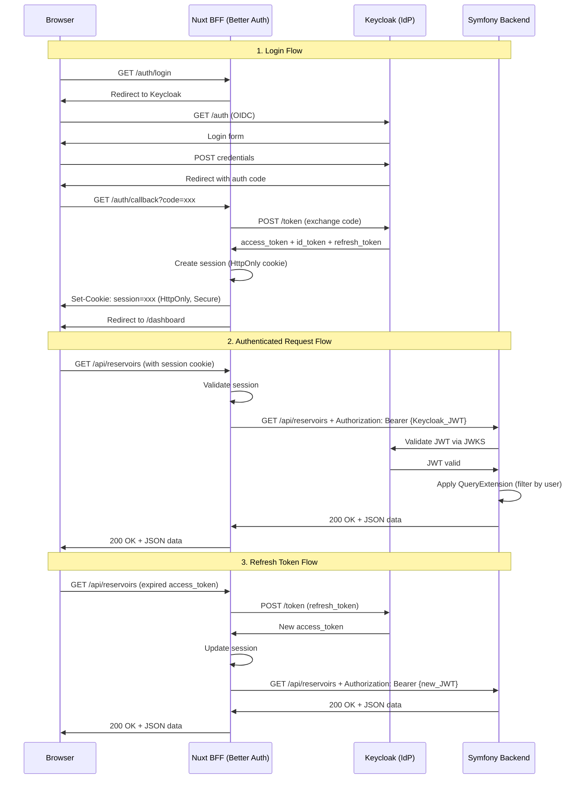

# EPIC-KEYCLOAK: Architecture SSO avec Keycloak + Better Auth

## 📋 Vue d'ensemble

### Objectifs Business

-   **Authentification centralisée** : Un seul point d'authentification pour tous les services HydroSense
-   **Gestion d'identité unifiée** : Centraliser les utilisateurs, rôles et permissions dans Keycloak
-   **Expérience utilisateur fluide** : SSO transparent entre frontend et backend
-   **Scalabilité** : Préparer l'architecture pour de futurs services (mobile, IoT, partenaires)
-   **Sécurité renforcée** : Standards OIDC, tokens JWT, sessions sécurisées

### Objectifs Techniques

-   Implémenter Better Auth comme BFF (Backend For Frontend) dans Nuxt
-   Configurer Keycloak comme Identity Provider (IdP) OIDC
-   Sécuriser les communications backend via validation JWT
-   Maintenir les Query Extensions de sécurité existantes (filtrage par user/farm)
-   Préserver la compatibilité avec l'architecture actuelle (API Platform)

---

## 🏗️ Architecture Globale

### Diagramme



### Composants

| Composant           | Rôle                                                | Technologie                |
| ------------------- | --------------------------------------------------- | -------------------------- |
| **Browser**         | Interface utilisateur                               | Vue 3 + Nuxt 4             |
| **Nuxt BFF**        | Backend For Frontend, gestion de session, proxy API | Better Auth + Nitro server |
| **Keycloak**        | Identity Provider, émission de tokens JWT           | Keycloak 23+ (OIDC)        |
| **Symfony Backend** | API REST, logique métier, données                   | Symfony 7 + API Platform   |

---

## 🔐 Flow d'Authentification Détaillé

### 1. Login (Authorization Code Flow)

1. **Utilisateur clique sur "Se connecter"**

    - Page Nuxt redirige vers `/auth/login` (Better Auth endpoint)

2. **Better Auth redirige vers Keycloak**

    - URL : `https://keycloak.example.com/realms/hydrosense/protocol/openid-connect/auth`
    - Paramètres : `client_id`, `redirect_uri`, `response_type=code`, `scope=openid profile email`

3. **Utilisateur s'authentifie sur Keycloak**

    - Formulaire de login Keycloak
    - MFA si activé
    - Consentement (première fois)

4. **Keycloak redirige avec code d'autorisation**

    - URL : `https://hydrosense.example.com/auth/callback?code=xxx&state=yyy`

5. **Better Auth échange le code contre des tokens**

    - POST vers Keycloak `/token` endpoint
    - Reçoit : `access_token` (JWT), `id_token` (JWT), `refresh_token`

6. **Better Auth crée une session**

    - Session cookie HttpOnly, Secure, SameSite=Lax
    - Stocke : `access_token`, `refresh_token`, user claims (`sub`, `email`, `roles`)

7. **Redirection vers l'application**
    - Utilisateur atterrit sur `/dashboard`
    - Session active, prêt à faire des requêtes API

### 2. Callback (server/api/auth/callback.ts)

**Responsabilités** :

-   Valider le `state` (CSRF protection)
-   Échanger le `code` contre des tokens
-   Extraire les claims du JWT
-   Créer la session Better Auth
-   Gérer les erreurs (invalid code, Keycloak down, etc.)

### 3. Session Better Auth

**Stockage** :

-   Cookie HttpOnly : `better_auth.session_token`
-   Contenu chiffré : `access_token`, `refresh_token`, `sub`, `email`, `roles`, `expiresAt`

**Avantages** :

-   Tokens JWT jamais exposés au browser (XSS protection)
-   Session persistante même si Keycloak redémarre
-   Refresh automatique transparent

### 4. Middleware Nuxt

**Fichier** : `frontend/middleware/auth.global.ts`

**Logique** :

```typescript
export default defineNuxtRouteMiddleware((to, from) => {
    const session = useBetterAuth().session;

    // Pages publiques (liste blanche)
    const publicPages = ["/login", "/"];
    if (publicPages.includes(to.path)) return;

    // Redirection si non authentifié
    if (!session.value?.user) {
        return navigateTo("/login");
    }

    // Check expiration du token
    if (isTokenExpired(session.value)) {
        // Tentative de refresh automatique
        return navigateTo("/auth/refresh");
    }
});
```

### 5. Appels BFF → Symfony

**Fichier** : `frontend/server/api/[...slug].ts` (proxy catch-all)

**Logique** :

1. Récupérer la session Better Auth
2. Extraire l'`access_token` Keycloak
3. Faire la requête vers Symfony avec `Authorization: Bearer {access_token}`
4. Retourner la réponse au browser

**Exemple** :

```typescript
export default defineEventHandler(async (event) => {
    const session = await getBetterAuthSession(event);
    if (!session) {
        throw createError({ statusCode: 401, message: "Not authenticated" });
    }

    const slug = event.context.params.slug;
    const backendUrl = `${process.env.NUXT_PUBLIC_API_BASE_URL}/${slug}`;

    const response = await $fetch(backendUrl, {
        headers: {
            Authorization: `Bearer ${session.accessToken}`,
            "Content-Type": "application/json",
        },
        method: event.method,
        body: event.method !== "GET" ? await readBody(event) : undefined,
    });

    return response;
});
```

---

## 🎭 Claims & Rôles

### Claims Keycloak Standard

| Claim                | Description              | Exemple                                |
| -------------------- | ------------------------ | -------------------------------------- |
| `sub`                | Subject (user ID unique) | `f47ac10b-58cc-4372-a567-0e02b2c3d479` |
| `email`              | Email de l'utilisateur   | `user@example.com`                     |
| `preferred_username` | Username                 | `john.doe`                             |
| `given_name`         | Prénom                   | `John`                                 |
| `family_name`        | Nom                      | `Doe`                                  |
| `email_verified`     | Email vérifié            | `true`                                 |

### Claims Personnalisés HydroSense

| Claim     | Description               | Configuration Keycloak                                  |
| --------- | ------------------------- | ------------------------------------------------------- |
| `roles`   | Rôles applicatifs         | Mapper : Realm Roles → Token Claim `roles` (JSON array) |
| `farm_id` | ID de la ferme par défaut | User Attribute `farm_id` → Token Claim `farm_id`        |

### Rôles Applicatifs

| Rôle         | Description          | Permissions                                                       |
| ------------ | -------------------- | ----------------------------------------------------------------- |
| `ROLE_USER`  | Utilisateur standard | CRUD sur ses propres ressources (farms, reservoirs, measurements) |
| `ROLE_ADMIN` | Administrateur       | Accès à toutes les ressources, bypass QueryExtensions             |
| `ROLE_API`   | Client API externe   | Lecture seule sur certaines ressources publiques                  |

### Configuration Keycloak

**Realm Roles** :

1. Créer les rôles : `ROLE_USER`, `ROLE_ADMIN`, `ROLE_API`
2. Assigner aux utilisateurs via l'UI Keycloak

**Client Scope Mapper** :

1. Aller dans le client `hydrosense-frontend`
2. Onglet "Client Scopes" → Onglet "Mappers" → "Add Mapper"
3. Choisir "User Realm Role"
4. Configuration :
    - Name : `roles`
    - Token Claim Name : `roles`
    - Claim JSON Type : `JSON`
    - Add to ID token : `ON`
    - Add to access token : `ON`
    - Add to userinfo : `ON`

---

## ⚙️ Décisions Techniques Importantes

### 🔑 Mode d'Authentification Backend : OPTION A (RECOMMANDÉE)

#### **OPTION A : Symfony valide directement le JWT Keycloak via JWKS**

**Description** :

-   Le BFF Nuxt transmet le `access_token` Keycloak dans le header `Authorization: Bearer {token}`
-   Symfony utilise `lexik/jwt-authentication-bundle` configuré pour valider via JWKS Keycloak
-   Symfony extrait les claims (`sub`, `email`, `roles`) du token
-   Les QueryExtensions utilisent le `sub` pour filtrer les ressources

**Avantages** :

-   ✅ **Sécurité maximale** : Symfony valide cryptographiquement chaque token
-   ✅ **Zero-trust** : Pas de confiance aveugle au BFF
-   ✅ **Stateless** : Symfony reste complètement stateless (pas de session)
-   ✅ **Scalabilité** : Facile à scale horizontalement (pas de session partagée)
-   ✅ **Auditabilité** : Logs Symfony contiennent l'identité réelle de l'utilisateur
-   ✅ **Compatibilité** : Prêt pour d'autres clients (mobile, CLI, IoT) qui appellent Symfony directement

**Inconvénients** :

-   ⚠️ **Latence** : Validation JWKS nécessite un cache (sinon 1 requête HTTP par token vers Keycloak)
-   ⚠️ **Configuration** : Nécessite de configurer Symfony pour pointer vers Keycloak JWKS

**Configuration Symfony** :

```yaml
# config/packages/lexik_jwt_authentication.yaml
lexik_jwt_authentication:
    secret_key: "" # Non utilisé si JWKS
    public_key: "" # Non utilisé si JWKS
    pass_phrase: ""
    token_ttl: 3600

    # Configuration JWKS pour Keycloak
    key_loader_class: Lexik\Bundle\JWTAuthenticationBundle\Services\JWKSLoader\JWKSLoader

    # URL du JWKS Keycloak
    jwks_url: "%env(KEYCLOAK_JWKS_URL)%"

    # Cache JWKS (important pour les performances)
    jwks_cache_ttl: 3600

# config/packages/security.yaml
security:
    providers:
        jwt_user_provider:
            id: App\Security\JwtUserProvider # Custom provider qui crée un User depuis les claims JWT

    firewalls:
        api:
            pattern: ^/api
            stateless: true
            jwt:
                provider: jwt_user_provider
                authenticator: lexik_jwt_authentication.jwt_token_authenticator
```

**UserProvider Custom** :

```php
// src/Security/JwtUserProvider.php
namespace App\Security;

use Symfony\Component\Security\Core\User\UserProviderInterface;

class JwtUserProvider implements UserProviderInterface
{
    public function loadUserByIdentifier(string $identifier): UserInterface
    {
        // $identifier = 'sub' claim du JWT (Keycloak user ID)

        // Option 1 : Créer un JwtUser en mémoire (stateless)
        return new JwtUser($identifier, $roles);

        // Option 2 : Synchroniser avec la DB (si besoin de données user supplémentaires)
        // return $this->userRepository->findOrCreateFromKeycloakId($identifier);
    }
}
```

**Variables d'environnement** :

```env
# .env.local (Symfony)
KEYCLOAK_JWKS_URL=https://keycloak.example.com/realms/hydrosense/protocol/openid-connect/certs
```

---

#### **OPTION B : BFF envoie X-User-Id / X-User-Roles (Full Trust)**

**Description** :

-   Le BFF Nuxt valide le token Keycloak
-   Le BFF extrait les claims et les envoie dans des headers custom (`X-User-Id`, `X-User-Roles`)
-   Symfony fait confiance aveuglément à ces headers

**Avantages** :

-   ✅ **Simplicité** : Pas besoin de configurer JWKS dans Symfony
-   ✅ **Performance** : Pas de validation JWT côté Symfony (latence réduite)

**Inconvénients** :

-   ❌ **Sécurité faible** : Si un attaquant peut contourner le BFF (ou si le BFF est compromis), Symfony est vulnérable
-   ❌ **Pas de zero-trust** : Symfony doit faire confiance au BFF
-   ❌ **Non scalable** : Si on ajoute un client mobile direct → pas compatible
-   ❌ **Auditabilité réduite** : Logs Symfony ne contiennent pas le token original

**Configuration Symfony** :

```yaml
# config/packages/security.yaml
security:
    firewalls:
        api:
            pattern: ^/api
            stateless: true
            custom_authenticators:
                - App\Security\BffHeaderAuthenticator
```

**Authenticator Custom** :

```php
// src/Security/BffHeaderAuthenticator.php
namespace App\Security;

use Symfony\Component\Security\Http\Authenticator\AbstractAuthenticator;

class BffHeaderAuthenticator extends AbstractAuthenticator
{
    public function authenticate(Request $request): PassportInterface
    {
        $userId = $request->headers->get('X-User-Id');
        $roles = json_decode($request->headers->get('X-User-Roles'), true);

        if (!$userId) {
            throw new AuthenticationException('Missing X-User-Id header');
        }

        return new SelfValidatingPassport(new UserBadge($userId), []);
    }
}
```

---

### 🏆 RECOMMANDATION FINALE : **OPTION A**

**Pourquoi ?**

-   HydroSense est une plateforme destinée à évoluer (mobile, IoT, partenaires)
-   La sécurité est critique pour des données agricoles/métier
-   L'architecture doit être prête pour du multi-client (pas seulement Nuxt)
-   Le coût de configuration JWKS est minimal comparé aux bénéfices
-   Better Auth + JWKS validation = defense-in-depth (double validation)

**Impact sur les QueryExtensions** :

-   Les QueryExtensions actuelles filtrent par `$user->getId()` (provenant de l'entité User en DB)
-   Avec OPTION A : on synchronise le `sub` Keycloak avec l'ID User Symfony (via un listener ou un UserProvider)
-   Alternative : modifier les QueryExtensions pour utiliser directement le `sub` du JWT (sans base de données User)

---

## 📁 Structure des Dossiers Impactés

```
frontend/
├── server/
│   ├── api/
│   │   ├── auth/
│   │   │   ├── [...better-auth].ts      # Better Auth catch-all handler
│   │   │   ├── session.get.ts           # Get current session
│   │   │   └── logout.post.ts           # Logout endpoint
│   │   └── bff/
│   │       └── [...slug].ts             # Proxy catch-all vers Symfony
│   ├── middleware/
│   │   └── auth.ts                      # Middleware Better Auth
│   └── utils/
│       └── better-auth.ts               # Config Better Auth + OIDC
├── middleware/
│   └── auth.global.ts                   # Middleware Nuxt global
├── composables/
│   ├── useBetterAuth.ts                 # Composable Better Auth
│   └── useApiClient.ts                  # Client API (utilise le BFF)
└── pages/
    ├── login.vue                        # Page de login (bouton "Se connecter avec Keycloak")
    └── auth/
        └── callback.vue                 # Page de callback OIDC

backend/
├── config/
│   └── packages/
│       ├── lexik_jwt_authentication.yaml  # Config JWKS Keycloak
│       └── security.yaml                  # Config JWT authenticator
├── src/
│   ├── Security/
│   │   ├── JwtUserProvider.php          # UserProvider pour JWT Keycloak
│   │   └── JwtUser.php                  # Entité User en mémoire (stateless)
│   └── Extension/
│       ├── JournalEntryQueryExtension.php  # (existant, à adapter si besoin)
│       ├── ReservoirQueryExtension.php     # (existant, à adapter si besoin)
│       └── FarmQueryExtension.php          # (existant, à adapter si besoin)
```

---

## 🌐 Variables d'Environnement

### Keycloak

**Realm** : `hydrosense`

**Client** : `hydrosense-frontend`

**Configuration** :

-   Client Protocol : `openid-connect`
-   Access Type : `confidential`
-   Valid Redirect URIs : `https://hydrosense.example.com/auth/callback`
-   Web Origins : `https://hydrosense.example.com`
-   Standard Flow Enabled : `ON`
-   Direct Access Grants Enabled : `OFF`

**Variables** :

```env
# Keycloak (fichier .env ou configuration admin UI)
KEYCLOAK_URL=https://keycloak.example.com
KEYCLOAK_REALM=hydrosense
KEYCLOAK_CLIENT_ID=hydrosense-frontend
KEYCLOAK_CLIENT_SECRET=xxx-xxx-xxx-xxx  # Généré par Keycloak
```

### Nuxt (Better Auth)

**Fichier** : `frontend/.env`

```env
# Better Auth
BETTER_AUTH_SECRET=xxx-xxx-xxx-xxx  # Générer avec: openssl rand -base64 32
BETTER_AUTH_URL=https://hydrosense.example.com

# Keycloak OIDC
NUXT_KEYCLOAK_ISSUER=https://keycloak.example.com/realms/hydrosense
NUXT_KEYCLOAK_CLIENT_ID=hydrosense-frontend
NUXT_KEYCLOAK_CLIENT_SECRET=xxx-xxx-xxx-xxx

# Backend Symfony
NUXT_PUBLIC_API_BASE_URL=https://api.hydrosense.example.com
```

### Symfony

**Fichier** : `backend/.env.local`

```env
# Keycloak JWKS
KEYCLOAK_JWKS_URL=https://keycloak.example.com/realms/hydrosense/protocol/openid-connect/certs

# CORS (autoriser le frontend)
CORS_ALLOW_ORIGIN=https://hydrosense.example.com
```

---

## ✅ Checklist de Configuration

### 1. Keycloak

-   [ ] Créer le realm `hydrosense`
-   [ ] Créer le client `hydrosense-frontend` (OIDC, confidential)
-   [ ] Configurer les redirect URIs (`/auth/callback`)
-   [ ] Créer les rôles : `ROLE_USER`, `ROLE_ADMIN`, `ROLE_API`
-   [ ] Configurer le mapper `roles` (Realm Roles → Token Claim)
-   [ ] Créer des utilisateurs de test avec rôles assignés
-   [ ] Tester le flow OIDC avec Postman ou curl

### 2. Nuxt (Better Auth)

-   [ ] Installer Better Auth : `npm install better-auth`
-   [ ] Installer le plugin SSO : `npm install @better-auth/sso`
-   [ ] Créer `server/utils/better-auth.ts` (config OIDC)
-   [ ] Créer `server/api/auth/[...better-auth].ts` (handler)
-   [ ] Créer `server/api/bff/[...slug].ts` (proxy vers Symfony)
-   [ ] Créer `middleware/auth.global.ts` (protection des routes)
-   [ ] Créer `composables/useBetterAuth.ts` (session management)
-   [ ] Créer `pages/login.vue` (bouton "Se connecter")
-   [ ] Créer `pages/auth/callback.vue` (page de callback)
-   [ ] Configurer les variables d'environnement (`.env`)

### 3. Symfony

-   [ ] Installer/configurer `lexik/jwt-authentication-bundle`
-   [ ] Configurer JWKS dans `lexik_jwt_authentication.yaml`
-   [ ] Créer `JwtUserProvider` (user provider depuis JWT claims)
-   [ ] Créer `JwtUser` (entité User en mémoire)
-   [ ] Modifier `security.yaml` (JWT authenticator + provider)
-   [ ] Adapter les QueryExtensions si nécessaire (utiliser `sub` du JWT)
-   [ ] Configurer CORS pour autoriser le frontend
-   [ ] Tester la validation JWT avec un token Keycloak
-   [ ] Tester les QueryExtensions (filtrage par user)

### 4. Tests End-to-End

-   [ ] Login via Keycloak → Callback → Session créée
-   [ ] Requête API depuis Nuxt → BFF → Symfony → JWT validé
-   [ ] QueryExtension filtre correctement les ressources par user
-   [ ] Refresh token automatique (avant expiration)
-   [ ] Logout → Session supprimée → Redirect vers login
-   [ ] Tester avec ROLE_USER (accès limité)
-   [ ] Tester avec ROLE_ADMIN (accès complet)

---

## 🚀 Plan d'Implémentation (Issues KEYCLOAK-2..12)

**Ordre recommandé** :

| Issue   | Titre                                                     | Priorité   | Dépendances |
| ------- | --------------------------------------------------------- | ---------- | ----------- |
| **#44** | KEYCLOAK-2 : Setup Keycloak (Docker Compose)              | 🔴 HAUTE   | -           |
| **#45** | KEYCLOAK-3 : Configuration Realm & Client Keycloak        | 🔴 HAUTE   | #44         |
| **#46** | KEYCLOAK-4 : Installation Better Auth + Plugin SSO (Nuxt) | 🔴 HAUTE   | -           |
| **#47** | KEYCLOAK-5 : Implémentation Flow OIDC (Login + Callback)  | 🔴 HAUTE   | #45, #46    |
| **#48** | KEYCLOAK-6 : Session Management Better Auth (Nuxt)        | 🟠 MOYENNE | #47         |
| **#49** | KEYCLOAK-7 : Middleware Nuxt (Protection Routes)          | 🟠 MOYENNE | #48         |
| **#50** | KEYCLOAK-8 : BFF Proxy API (Nuxt → Symfony)               | 🔴 HAUTE   | #48         |
| **#51** | KEYCLOAK-9 : Config JWKS Symfony + JwtUserProvider        | 🔴 HAUTE   | #45         |
| **#52** | KEYCLOAK-10 : Adaptation QueryExtensions (sub → user_id)  | 🟠 MOYENNE | #51         |
| **#53** | KEYCLOAK-11 : Tests End-to-End SSO                        | 🟡 BASSE   | #50, #52    |
| **#54** | KEYCLOAK-12 : Documentation Utilisateur + Admin           | 🟡 BASSE   | Toutes      |

**Notes** :

-   Les issues 44-47 constituent le **MVP** (login fonctionnel)
-   Les issues 48-50 rendent le système **utilisable** en production
-   Les issues 51-52 assurent la **sécurité backend**
-   Les issues 53-54 finalisent la **qualité** et la **documentation**

---

## 📚 Ressources

### Documentation Officielle

-   [Better Auth Documentation](https://www.better-auth.com/)
-   [Better Auth SSO Plugin](https://www.better-auth.com/docs/plugins/sso)
-   [Keycloak Documentation](https://www.keycloak.org/documentation)
-   [OAuth 2.0 Authorization Code Flow](https://oauth.net/2/grant-types/authorization-code/)
-   [OpenID Connect Core 1.0](https://openid.net/specs/openid-connect-core-1_0.html)
-   [LexikJWTAuthenticationBundle](https://github.com/lexik/LexikJWTAuthenticationBundle)

### Liens Utiles

-   Keycloak Admin Console : `https://keycloak.example.com/admin`
-   Keycloak JWKS Endpoint : `https://keycloak.example.com/realms/hydrosense/protocol/openid-connect/certs`
-   Symfony Debug JWT : `php bin/console lexik:jwt:debug-token YOUR_TOKEN`

---

## 🔒 Considérations de Sécurité

### 1. Protection XSS

-   ✅ Session Better Auth stockée dans cookie HttpOnly
-   ✅ Tokens JWT jamais exposés au JavaScript browser

### 2. Protection CSRF

-   ✅ Better Auth utilise le paramètre `state` OIDC
-   ✅ Cookies SameSite=Lax

### 3. Protection Man-in-the-Middle

-   ✅ HTTPS obligatoire en production (Keycloak + Nuxt + Symfony)
-   ✅ Cookies Secure=true

### 4. Token Expiration

-   ✅ Access token Keycloak : 5 minutes (courte durée)
-   ✅ Refresh token : 30 jours (rotation automatique)
-   ✅ Session Better Auth : 7 jours (configurable)

### 5. Rate Limiting

-   ⚠️ À implémenter : Rate limiting sur `/auth/login` et `/auth/callback`
-   ⚠️ À implémenter : Rate limiting Keycloak (built-in)

### 6. Audit Logs

-   ✅ Keycloak logs tous les événements d'authentification
-   ✅ Symfony logs toutes les requêtes API avec user ID
-   ⚠️ À implémenter : Logs centralisés (ELK, Loki, etc.)

---

## 🐛 Troubleshooting

### Problème : "Invalid redirect_uri"

**Cause** : Keycloak rejette le callback car l'URI n'est pas dans la whitelist

**Solution** :

1. Aller dans Keycloak Admin → Client `hydrosense-frontend`
2. Ajouter l'URI exacte dans "Valid Redirect URIs" : `https://hydrosense.example.com/auth/callback`
3. Sauvegarder

### Problème : "JWT signature verification failed"

**Cause** : Symfony ne peut pas valider le token Keycloak (JWKS)

**Solution** :

1. Vérifier que `KEYCLOAK_JWKS_URL` est correct dans `.env.local`
2. Tester l'URL JWKS : `curl https://keycloak.example.com/realms/hydrosense/protocol/openid-connect/certs`
3. Vider le cache Symfony : `php bin/console cache:clear`
4. Vérifier les logs : `tail -f var/log/dev.log`

### Problème : "Session expired" constant

**Cause** : Le refresh token ne fonctionne pas

**Solution** :

1. Vérifier la config Keycloak : "Access Token Lifespan" et "Refresh Token Max Lifespan"
2. Vérifier que Better Auth appelle bien `/token` avec `refresh_token`
3. Activer les logs Better Auth (niveau DEBUG)

### Problème : QueryExtension ne filtre pas correctement

**Cause** : Le `sub` Keycloak ne correspond pas à l'ID User Symfony

**Solution** :

1. Synchroniser les IDs : ajouter un champ `keycloak_id` dans l'entité User
2. Modifier les QueryExtensions pour utiliser `keycloak_id` au lieu de `id`
3. OU : utiliser un UserProvider qui mappe `sub` → User automatiquement

---

## 📝 Notes Finales

### Compatibilité avec l'Architecture Actuelle

-   ✅ Les entités existantes (Farm, Reservoir, Measurement, etc.) ne changent PAS
-   ✅ Les QueryExtensions continuent de fonctionner (avec adaptation mineure)
-   ✅ Les endpoints API Platform restent identiques
-   ✅ Le client OpenAPI frontend reste compatible (appels via BFF)

### Migration Progressive

**Phase 1** : Setup Keycloak + Better Auth (issues 44-47)

-   Keycloak en place, login fonctionnel
-   JWT validé par Symfony
-   **Cohabitation** : l'ancien système JWT Symfony reste actif en parallèle

**Phase 2** : Migration des utilisateurs (hors scope EPIC-KEYCLOAK)

-   Importer les users Symfony vers Keycloak
-   Mapper les rôles Symfony → Roles Keycloak
-   Désactiver l'ancien `/api/auth/login` Symfony

**Phase 3** : Optimisations (issues 53-54)

-   Cache JWKS optimisé
-   Monitoring (Prometheus, Grafana)
-   Documentation complète

---

## 🎯 Succès de l'EPIC

L'EPIC KEYCLOAK sera considérée comme **terminée** quand :

-   [ ] Un utilisateur peut se connecter via Keycloak depuis Nuxt
-   [ ] La session Better Auth est créée et persiste
-   [ ] Les requêtes API passent par le BFF et sont authentifiées
-   [ ] Symfony valide les JWT Keycloak via JWKS
-   [ ] Les QueryExtensions filtrent correctement par utilisateur
-   [ ] Les rôles `ROLE_USER` et `ROLE_ADMIN` fonctionnent
-   [ ] Le refresh token fonctionne automatiquement
-   [ ] La documentation est complète et à jour
-   [ ] Les tests E2E passent (login → API call → logout)

---

**Auteur** : GitHub Copilot  
**Date** : 21 novembre 2025  
**Version** : 1.0  
**Statut** : Architecture validée, prête pour implémentation
