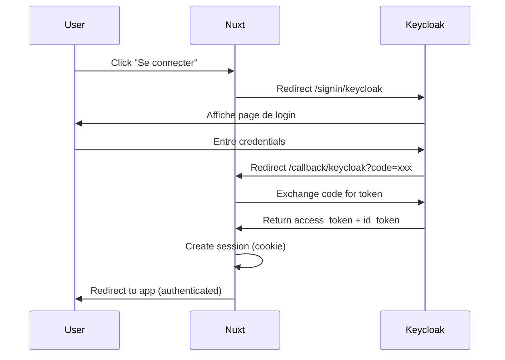

# Better Auth + Keycloak SSO - Issue KEYCLOAK-4 ✅

## Status: Complété

Installation et configuration de Better Auth avec support SSO Keycloak pour Nuxt 4.

## 🎯 Objectifs Atteints

- ✅ Better Auth installé et configuré côté serveur (BFF)
- ✅ Endpoints API d'authentification créés
- ✅ Session endpoint fonctionnel (`GET /api/auth/session`)
- ✅ Composable `useAuth()` pour le frontend
- ✅ Page de test `/auth-test` opérationnelle
- ✅ Configuration via runtimeConfig (secrets sécurisés)

## 📁 Fichiers Créés

### Server (Backend BFF)

```
server/
├── utils/
│   └── auth.ts                          # Configuration Better Auth
└── api/
    └── auth/
        ├── session.get.ts               # GET /api/auth/session
        ├── signout.post.ts              # POST /api/auth/signout
        ├── signin/
        │   └── keycloak.get.ts          # GET /api/auth/signin/keycloak
        ├── callback/
        │   └── keycloak.get.ts          # GET /api/auth/callback/keycloak
        └── [...all].ts                  # Catch-all Better Auth (WIP)
```

### Frontend

```
app/
├── composables/
│   └── useAuth.ts                       # Composable d'authentification
└── pages/
    └── auth-test.vue                    # Page de test SSO
```

### Configuration

```
.env.example                             # Variables d'environnement
nuxt.config.ts                           # Runtime config mise à jour
tsconfig.json                            # Support Node.js types
```

## 🔧 Configuration

### Variables d'Environnement

Créer `.env` dans `/frontend`:

```env
# Better Auth
BETTER_AUTH_SECRET=your-secret-key-min-32-characters-long
BETTER_AUTH_URL=http://localhost:3000

# Keycloak
KEYCLOAK_CLIENT_ID=hydrosense-web-bff
KEYCLOAK_DISCOVERY_URL=http://localhost:8080/realms/hydrosense/.well-known/openid-configuration
```

### Runtime Config (nuxt.config.ts)

```ts
runtimeConfig: {
  // Server-side only
  betterAuthSecret: process.env.BETTER_AUTH_SECRET,
  betterAuthUrl: process.env.BETTER_AUTH_URL,
  keycloakDiscoveryUrl: process.env.KEYCLOAK_DISCOVERY_URL,
  keycloakClientId: process.env.KEYCLOAK_CLIENT_ID,

  // Public (client-side)
  public: {
    apiBaseUrl: process.env.NUXT_PUBLIC_API_BASE_URL || "http://localhost:8000",
  },
}
```

## 🚀 API Endpoints

### 1. Session (✅ Fonctionnel)

```bash
GET /api/auth/session
```

Retourne:

```json
{
  "session": null,
  "user": null
}
```

### 2. Connexion Keycloak

```bash
GET /api/auth/signin/keycloak
```

Redirige vers Keycloak pour l'authentification SSO.

### 3. Callback OAuth

```bash
GET /api/auth/callback/keycloak?code=xxx&state=xxx
```

Traite le retour Keycloak et crée une session locale.

### 4. Déconnexion

```bash
POST /api/auth/signout
```

Détruit la session utilisateur.

## 💻 Usage Frontend

### Composable useAuth

```vue
<script setup>
import { useAuth } from "~/composables/useAuth";

const {
  session, // État de la session
  user, // Utilisateur courant
  isAuthenticated, // Boolean: est authentifié?
  signIn, // () => void: Rediriger vers Keycloak
  signOut, // () => Promise<void>: Se déconnecter
  fetchSession, // () => Promise<AuthSession>: Rafraîchir
} = useAuth();

// Charger la session
onMounted(async () => {
  await fetchSession();
});
</script>

<template>
  <div>
    <p v-if="isAuthenticated">Bonjour {{ user.name }}!</p>

    <button v-if="!isAuthenticated" @click="signIn">Se connecter</button>

    <button v-else @click="signOut">Se déconnecter</button>
  </div>
</template>
```

### Page de Test

Accéder à: http://localhost:3000/auth-test

## 🔐 Flow d'Authentification



## ⚠️ Points d'Attention / TODO

### 1. PKCE Implementation

Le flow PKCE actuel est simplifié. Pour la production:

- [ ] Générer un `code_verifier` cryptographiquement sécurisé
- [ ] Calculer le `code_challenge` avec SHA-256
- [ ] Stocker le `code_verifier` en session pour le callback
- [ ] Utiliser le bon `code_verifier` lors de l'échange de code

### 2. Session Management

- [ ] Implémenter le stockage de session (cookie HttpOnly)
- [ ] Gérer l'expiration des sessions
- [ ] Refresh token automatique
- [ ] Synchronisation session Keycloak ↔ Nuxt

### 3. CSRF Protection

- [ ] Vérifier le paramètre `state` dans le callback
- [ ] Stocker et valider le state CSRF token

### 4. Base de Données (Optionnel)

Pour persister les utilisateurs/sessions:

```ts
// server/utils/auth.ts
export const auth = betterAuth({
  // ...
  database: {
    provider: "postgres",
    url: process.env.DATABASE_URL,
  },
});
```

### 5. Keycloak Logout

Implémenter la déconnexion Keycloak complète:

```ts
// server/api/auth/signout.post.ts
const logoutUrl = `${keycloakUrl}/protocol/openid-connect/logout`;
const params = new URLSearchParams({
  id_token_hint: session.idToken,
  post_logout_redirect_uri: config.betterAuthUrl,
});
return sendRedirect(event, `${logoutUrl}?${params}`);
```

## 🧪 Tests

### Test Manuel

1. **Démarrer les services:**

   ```bash
   # Terminal 1: Keycloak
   docker-compose up keycloak

   # Terminal 2: Nuxt
   cd frontend
   npm run dev
   ```

2. **Accéder à la page de test:**

   ```
   http://localhost:3000/auth-test
   ```

3. **Vérifier l'endpoint session:**

   ```bash
   curl http://localhost:3000/api/auth/session
   # Retourne: {"session":null,"user":null}
   ```

4. **Tester la redirection Keycloak:**
   - Cliquer sur "Se connecter via Keycloak"
   - Vérifier la redirection vers Keycloak
   - S'authentifier
   - Vérifier le retour sur l'application

### Tests Automatisés (À implémenter)

```bash
# TODO: Ajouter tests E2E avec Playwright
npm run test:e2e
```

## 📚 Documentation

- [Better Auth Docs](https://www.better-auth.com/docs)
- [Keycloak OIDC](https://www.keycloak.org/docs/latest/securing_apps/#_oidc)
- [Nuxt 4 Server](https://nuxt.com/docs/guide/directory-structure/server)
- [PKCE RFC 7636](https://datatracker.ietf.org/doc/html/rfc7636)

## 🎉 Acceptance Criteria

- ✅ Better Auth installé (`npm install better-auth`)
- ✅ Fichier `server/utils/auth.ts` créé
- ✅ Handler `server/api/auth/[...all].ts` créé
- ✅ GET `/api/auth/session` retourne session ou null
- ✅ Configuration via runtimeConfig
- ✅ Code commenté et documenté
- ✅ BFF côté serveur (pas d'appels client direct)

## 📝 Notes

- **Version Better Auth:** 1.3.34
- **Version Nuxt:** 4.2.1
- **Structure:** Nuxt 4 avec dossier `app/`
- **Mode:** SSR (Server-Side Rendering)
- **Environnement:** Développement local

---

**Issue:** KEYCLOAK-4  
**Branche:** `44-keycloak-2-ajouter-keycloak-en-dev-docker-compose`  
**Date:** 21 novembre 2025  
**Status:** ✅ Complété (configuration de base)
